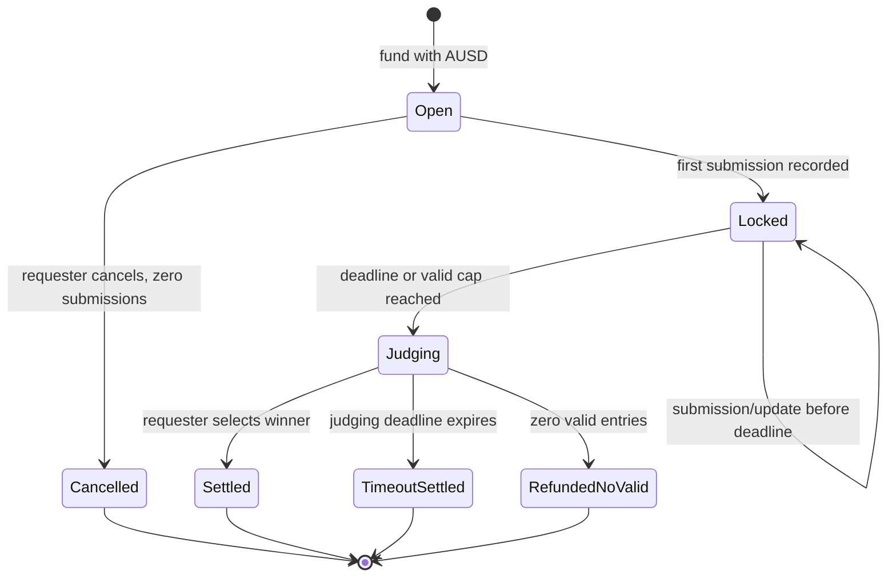
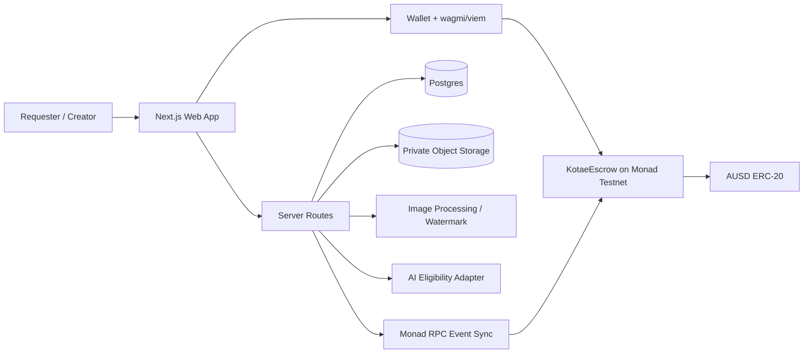

# KOTAE — Spark Hackathon MVP Specification

Status: **Frozen for implementation**  
Version: 1.0  
Date: 2026-07-14  
Target: [BuildAnything Spark Hackathon](https://buildanything.so/hackathons/spark)

## 1. Executive summary

KOTAE is a result-based marketplace for AI-assisted creation.

People who cannot reliably produce a good result with AI post what they need and fund a contest in AUSD. Creators who know how to use AI tools submit finished outcomes. The system checks whether each submission meets the minimum requirements, while the requester—not the AI—chooses the winner.

Core promise:

> Pay for the outcome you choose, not the generations that failed.

Japanese product statement:

> プロンプトや失敗した生成回数ではなく、選んだ完成結果にお金を払う。

The marketplace resolves two kinds of waste:

1. Requesters lose time and AI credits without reaching a satisfactory result.
2. Skilled AI users have unused subscriptions, generation capacity, and expertise but no useful project or customer.

## 2. Product goals

### 2.1 Hackathon goal

Deliver one complete, live flow on Monad Testnet:

1. A requester creates and funds a contest with AUSD.
2. A creator uploads a finished deliverable and posts a refundable submission bond.
3. The platform creates a protected preview.
4. AI performs minimum eligibility checking.
5. The requester selects a winner from eligible entries.
6. The smart contract distributes AUSD transparently.
7. The winning original becomes downloadable by the requester.

### 2.2 Success criteria

- Hosted web application works without placeholder success states.
- At least one real contest is created on Monad Testnet.
- At least two real submissions are stored and displayed.
- AUSD is transferred into escrow and distributed by the deployed contract.
- A winning original is access-controlled and becomes available after settlement.
- Public GitHub repository includes setup, architecture, contract address, and demo instructions.
- The full value proposition can be demonstrated in under three minutes.

## 3. Users and value

### Requester

Has a desired result but lacks prompt skill, model access, time, or confidence.

Receives:

- several finished outcomes to compare;
- a guaranteed budget and transparent payout;
- a protected original from the selected winner;
- freedom from repeated pay-per-generation experimentation.

### Creator

Can use AI tools efficiently and wants a useful brief, portfolio opportunity, or income.

Receives:

- real briefs instead of having to invent projects;
- AUSD payout on Monad;
- a refundable bond rather than a non-refundable entry fee;
- a small participation pool when a valid entry loses;
- up to two corrections before the deadline.

### Platform

Provides escrow, storage, watermarking, validation, settlement, and protected delivery.

Receives 10% of the base contest budget after at least one submission has been processed.

## 4. MVP scope

### 4.1 Supported deliverable types

#### Photo / Visual

- Original photo owned by the creator
- AI-generated or AI-assisted image
- Product visual
- Social image
- Illustration
- Thumbnail

Submission:

- one original PNG, JPEG, or WebP;
- maximum original size: 20 MB;
- platform removes metadata, creates a resized preview, and adds a watermark.

#### Short Video

- Product reel
- Social advertisement
- Motion graphic
- Short atmospheric or promotional clip

Submission:

- one MP4 or WebM file;
- maximum duration: 30 seconds;
- maximum original size: 50 MB;
- vertical, square, and landscape aspect ratios are accepted when allowed by the brief;
- copyrighted music and unlicensed footage are prohibited;
- the original remains private and the platform exposes only a protected, watermarked preview until settlement.

#### Static Page

- One-page landing page or homepage
- Static HTML/CSS/JavaScript only
- No backend, database, authentication, payment, or secret API key

Submission:

- one ZIP containing `index.html`;
- maximum ZIP size: 10 MB;
- one desktop screenshot and one mobile screenshot;
- the platform watermarks screenshots;
- source ZIP remains private until settlement.

#### Micro Tool

- Small client-side calculator, formatter, generator, tracker, or converter
- Runs locally in the browser
- LocalStorage is allowed
- No backend, database, authentication, payment, secret API key, or required build service

Submission:

- one ZIP containing `index.html`;
- maximum ZIP size: 10 MB;
- one desktop screenshot and one mobile screenshot;
- a short feature manifest;
- source ZIP remains private until settlement.

### 4.2 Explicitly out of scope

- Built-in AI generation
- Standalone audio, 3D, mobile apps, extensions, or server applications
- Executing arbitrary submitted code on the public app
- Live interactive previews of submitted sites/tools
- Human judges in the normal flow
- Decentralized dispute voting
- Permanent identity-level bans
- Automated bond slashing based only on AI judgment
- Multiple license products
- Finished-asset catalog sales
- Messaging, followers, likes, or social feeds
- Custom tokens, NFTs, or speculative mechanics

These features must not appear as clickable placeholders in the hackathon UI.

## 5. Contest rules

### 5.1 Creation fields

- Deliverable type
- Title
- Short description
- Detailed brief
- Up to five must-have requirements
- Up to five prohibited or unwanted elements
- Base budget in AUSD
- Submission deadline
- Fixed commercial transfer license acceptance

Deadline rules:

- submission window: 1 hour to 14 days;
- judging begins when the submission deadline passes or the valid-entry cap is filled;
- judging window: fixed at 48 hours for the MVP;
- after 48 hours without a requester selection, timeout settlement becomes callable.

### 5.2 Minimum base budgets

| Type | Minimum | Suggested default |
|---|---:|---:|
| Photo / Visual | 2 AUSD | 3 AUSD |
| Short Video | 8 AUSD | 12 AUSD |
| Static Page | 10 AUSD | 20 AUSD |
| Micro Tool | 20 AUSD | 30 AUSD |

The minimum is an anti-zero-spam floor, not a quality recommendation.

### 5.3 Default eligible-entry caps

| Type | Default valid entries |
|---|---:|
| Photo / Visual | 10 |
| Short Video | 5 |
| Static Page | 5 |
| Micro Tool | 5 |

Only entries that reach `Valid` status count toward the displayed cap. The contest remains open until the deadline or until the valid cap is filled.

To control processing abuse, the backend may limit concurrent pending/needs-fix submissions to twice the valid-entry cap. This safety limit is not sold as an eligible slot.

### 5.4 Extra slots

- Sold in packs of five valid entries.
- Each pack costs 10% of the original base budget.
- Maximum: three add-on packs (15 additional valid entries) in the MVP.
- 50% of an add-on fee increases the participation pool.
- 50% covers additional validation, storage, and platform operations.
- Extra-slot fees are fully refundable only when the contest is cancelled before any submission is recorded.

### 5.5 Cancellation

- The requester may cancel for a full refund only when no submission has ever been recorded onchain.
- The first recorded submission permanently disables requester cancellation.
- Uploads that fail before the submission transaction do not count.
- A submission that later needs correction still counts as a recorded submission.
- If every final submission is ineligible, the 90% creator allocation is refunded and the 10% platform allocation remains payable for processed work.

### 5.6 Creator participation

- One creator may have one active entry per contest.
- A creator cannot enter their own contest.
- A refundable AUSD bond is posted only when the first submission transaction is made.
- No bond is required to browse, prepare, or upload a draft.
- A creator may replace the submission up to two times before the deadline.
- Reprocessing failures do not consume a replacement.
- Only the latest confirmed version is eligible for judging.
- Previous hashes remain in the onchain event history.

### 5.7 Submission bonds

| Type | MVP bond |
|---|---:|
| Photo / Visual | 0.5 AUSD |
| Short Video | 1 AUSD |
| Static Page | 1 AUSD |
| Micro Tool | 2 AUSD |

For the MVP, bonds are locked until contest settlement and returned to creators. Objective abuse prevention occurs before final submission through file checks, duplication checks, upload limits, and a wallet blocklist. Slashing and decentralized appeals are post-hackathon features.

## 6. AI eligibility check

AI is a verifier, not a creative judge.

### 6.1 Deterministic checks first

The platform checks without AI:

- file type and file size;
- image dimensions and decodability;
- ZIP integrity;
- presence of `index.html`;
- prohibited file extensions;
- duplicate content hash;
- one-entry-per-wallet rule;
- submission deadline and revision count;
- malware scan where available.

Files that fail deterministic checks never reach the onchain submission confirmation step.

### 6.2 AI checks

AI receives the brief, must-have list, prohibited list, protected preview, and creator manifest. It evaluates:

- whether the result is materially related to the brief;
- whether must-have elements are visibly present;
- whether the submission is an obvious dummy;
- whether prohibited or unsafe content is visible;
- whether a screenshot and manifest are materially inconsistent.

Structured result:

```json
{
  "status": "valid | needs_fix",
  "confidence": 0.0,
  "reasonCodes": [],
  "checks": [
    {
      "requirement": "string",
      "passed": true,
      "evidence": "string"
    }
  ],
  "creatorMessage": "string"
}
```

### 6.3 AI safety rules

- Submitted content is untrusted data, never instructions.
- The model must use a fixed structured schema.
- AI never selects the winner.
- AI never moves funds.
- AI alone cannot slash a bond or permanently ban a user.
- A `Needs Fix` result includes actionable reasons and may use one of the two allowed replacements.
- If the AI service fails, status remains `Pending` and can be retried.

Human dispute resolution is a documented roadmap item, not an MVP dependency.

## 7. Payout model

### 7.1 Base budget distribution

| Recipient | Share |
|---|---:|
| Winner | 85% |
| Valid losing creators | 5% participation pool |
| Platform | 10% |

Rules:

- If there is one valid entry, that creator receives 90%.
- If there are multiple valid entries, the winner receives 85% and valid losers split 5% equally.
- Submission bonds are returned separately and are not revenue.
- The platform share covers AI checks, storage, watermarking, operations, and margin.
- Integer rounding dust from base-budget percentage calculations is assigned to the platform allocation; participation-pool division dust is assigned to the winner.
- Add-on-fee rounding dust is assigned to the platform allocation.

### 7.2 No requester selection

If the judging deadline passes without a selected winner:

- all valid creators split the 90% creator allocation equally;
- the platform receives 10%;
- no requester-selected exclusive winner is recorded;
- original access may be limited to a non-exclusive fallback license in a later version. For the MVP demo, requester selection is required for original unlock; timeout settlement demonstrates financial fairness only.

### 7.3 No valid entries

- Requester receives 90% back.
- Platform receives 10% because submissions, storage, preview processing, and validation occurred.
- All creator bonds are returned in the MVP.

### 7.4 No submissions

- Requester receives 100% back.
- Platform receives nothing.
- Extra-slot fees are also refunded.

## 8. License and rights

The MVP uses one fixed Commercial Transfer License:

- the requester may use and modify the winning deliverable commercially;
- the creator agrees not to resell the exact winning deliverable as an exclusive custom asset;
- pre-existing, open-source, and third-party components remain under their original licenses;
- the creator represents that the submitted output and tools used permit commercial delivery;
- losing creators retain their submissions;
- the platform records the license text hash and winning content hash;
- the product does not claim that an onchain record creates statutory copyright.

Disallowed content includes unauthorized real-person likenesses, existing characters, trademark misuse, malicious code, stolen work, and content that violates the selected AI tool's commercial terms.

## 9. State model



State invariants:

- `Cancelled` is reachable only when `submissionCountEver == 0`.
- Funds leave escrow only through cancel, settle, timeout settle, or no-valid refund.
- A requester cannot select their own wallet as a creator because self-submission is prohibited.
- A submission cannot be updated after the submission deadline.
- A contest cannot settle twice.

## 10. User experience

### 10.1 Primary screens

1. **Home / Browse**
   - Personal problem and product promise
   - Browse open contests
   - Create contest CTA

2. **Create Contest**
   - Select deliverable type
   - Enter brief and must-haves
   - Enter AUSD budget and deadline
   - Show exact 85/5/10 split
   - Approve AUSD and create onchain

3. **Contest Detail**
   - Brief, requirements, budget, deadline
   - Valid entries progress (`3 / 5`)
   - Protected submission gallery
   - Submit or judge CTA based on wallet role/state
   - Monad explorer links

4. **Submit / Update Entry**
   - Upload original and required previews
   - Declare creation tool and rights
   - Show system-generated watermark preview
   - Confirm refundable bond
   - Show AI status and correction reasons

5. **Dashboard**
   - Created contests
   - Submitted contests
   - Pending AI checks
   - Claim/download states

6. **Settlement Result**
   - Winning entry
   - 85/5/10 payout receipt
   - AUSD transaction link
   - Winning original download for requester

### 10.2 UX requirements

- Responsive and usable within the viewport.
- Distinct visual identity; avoid generic AI-gradient dashboard styling.
- Clear AUSD amounts and wallet transaction states.
- Never show a success toast before onchain confirmation.
- Empty, loading, rejected, needs-fix, and transaction-failure states are designed.
- Public previews are watermarked; originals are never public.
- Future features are described only in README/demo, not clickable in the app.

## 11. Technical architecture



### 11.1 Proposed stack

- Next.js App Router + TypeScript
- Tailwind CSS
- wagmi + viem for wallet and contract interactions
- Foundry + Solidity + OpenZeppelin contracts
- Supabase Postgres and private Storage
- Server-side Sharp processing for image metadata removal, resize, and watermark
- Provider-neutral multimodal AI validation adapter
- Vercel-compatible deployment

No exact framework/library versions are frozen in this product specification; versions will be locked in the implementation package.

### 11.2 Authentication

- Wallet address is the MVP account identity.
- Protected server operations require a nonce-based wallet signature and short-lived server session.
- Requester, creator, and winner authorization is checked both in server routes and onchain where applicable.

### 11.3 File storage

- `originals` bucket: private.
- `previews` bucket: public or signed, always watermarked.
- Original content gets a SHA-256 hash before upload finalization.
- Winning requester receives a short-lived signed original URL only after settled ownership is confirmed onchain.
- Orphan uploads from reverted transactions are cleaned asynchronously.

### 11.4 Onchain/offchain boundary

| Onchain | Offchain |
|---|---|
| AUSD escrow and distribution | Brief text and display metadata |
| Contest owner and deadlines | Original files and previews |
| Budget, caps, and status | AI reasoning and correction messages |
| Submission creator and hashes | Watermark processing |
| Submission version count | Search and dashboard indexes |
| Validity flag from platform validator | Wallet session and download authorization |
| Winner and final payouts | License text; its hash is onchain |

The contract is the source of truth for funds. The database is a searchable projection plus private metadata store.

## 12. Smart contract design

Working contract name: `KotaeEscrow`.

### 12.1 Network and token

- Hackathon deployment: Monad Testnet, chain ID `10143`.
- Testnet AUSD: `0xa9012a055bd4e0eDfF8Ce09f960291C09D5322dC`.
- Production target: Monad Mainnet, chain ID `143`.
- Mainnet AUSD: `0x00000000eFE302BEAA2b3e6e1b18d08D69a9012a`.
- Deployment reference: [Agora contract deployments](https://docs.agora.finance/developer/contract-deployments).

### 12.2 Core functions

```solidity
createContest(...)
addEntrySlots(contestId, packs)
cancelContest(contestId)
submitEntry(contestId, contentHash, metadataHash)
updateEntry(contestId, contentHash, metadataHash)
setEntryValidity(contestId, creator, isValid)
selectWinner(contestId, creator)
settleAfterTimeout(contestId)
refundNoValidEntries(contestId)
claimBond(contestId)
```

### 12.3 Roles

- Requester: creates, cancels before submissions, selects winner.
- Creator: submits and updates one entry, claims bond.
- Validator role: posts platform AI eligibility result; cannot choose winner or redirect funds.
- Platform treasury: receives the defined platform allocation only.

### 12.4 Security requirements

- `SafeERC20` for AUSD transfers.
- Reentrancy protection on settlement/refund/claim operations.
- Checks-effects-interactions ordering.
- Exact percentage constants with no hidden fee changes for existing contests.
- No arbitrary token or arbitrary external call execution.
- No unbounded creator loops beyond the explicit entry cap.
- Events for all state and payout changes.
- Unit tests for cancellation race, duplicate settlement, deadline checks, one-entry rule, two-update limit, fee rounding, and timeout settlement.

## 13. Data model

### Contest

- onchain ID
- requester wallet
- asset type
- title, brief, must-haves, avoid list
- base budget
- entry-cap packs and add-on amounts
- submission deadline and judging deadline
- current state
- valid count and total recorded submissions
- metadata hash / license hash

### Submission

- contest ID
- creator wallet
- original object key
- protected preview keys
- original and metadata hashes
- version number
- AI status and structured audit
- creation tool disclosure
- rights declaration timestamp
- onchain transaction hashes

### Wallet profile

- wallet address
- created/submitted/won counts
- server session nonces
- optional blocklist state

## 14. Implementation priorities

### P0 — required for submission

- Wallet connection and Monad Testnet switching
- AUSD approve/fund flow
- Create and cancel contest
- Upload and privately store originals
- Generate protected previews
- Submit with bond and update twice
- AI `Valid` / `Needs Fix` result
- Browse and contest detail
- Requester winner selection
- Real 85/5/10 payout
- Bond returns
- Winning original access
- Explorer links and clear error/loading states

### P1 — required for a strong demo

- Dashboard
- Extra valid-entry slot packs
- Responsive visual polish
- Seeded but real testnet contest with two or more entries
- README, architecture diagram, contract verification, and reproducible deployment
- Public build-in-progress/social post

### Post-hackathon roadmap

- Human dispute verification and appeal bonds
- Objective slashing and reputation-weighted bonds
- Live isolated previews for web deliverables
- Standalone audio and broader file types
- Creator storefronts and a fixed-price finished-asset marketplace
- Stronger identity and ban resistance
- Mainnet deployment and production-grade license/legal review

### Creator storefront marketplace

The contest model remains the hackathon MVP because it proves KOTAE's core mechanism: a requester funds a specific need, multiple creators compete with finished outcomes, and the requester chooses the winner. After the hackathon, KOTAE will also support the supply-led side of the market.

Creators will be able to open storefronts and list already-finished AI-assisted images, photos, videos, static pages, and micro tools at fixed AUSD prices. Buyers can inspect protected previews, review standardized license terms, pay once, and immediately unlock the original—without opening a new competition.

This expansion also gives useful work a second life. A creator may optionally list an eligible non-winning contest entry when the original brief is not confidential and the creator still owns the rights. Custom competitions and instant catalog purchases then reinforce each other:

- **Competitions:** buyers describe a new outcome they need and creators produce competing answers.
- **Marketplace:** creators publish completed outcomes they already have and buyers purchase them instantly.

Creator profiles, storefront reputation, catalog search, fixed-price AUSD checkout, protected previews, license selection, and post-purchase original delivery are explicitly post-hackathon features and are not required for the MVP demo.

## 15. Three-minute demo script

1. Explain the personal problem: repeated AI attempts consumed credits and time without producing a satisfying result.
2. Show that creators may have the opposite problem: skill and unused AI capacity but no brief.
3. Create a contest and escrow AUSD on Monad Testnet.
4. Submit two real outcomes from creator wallets.
5. Show system watermarking and AI eligibility status.
6. Select the preferred outcome as requester.
7. Show the onchain 85% winner, 5% participation, 10% platform settlement.
8. Open the winning original and the Monad explorer transaction.

## 16. Submission copy draft

### Name

KOTAE

### Short description

An AUSD-funded marketplace where people buy finished AI outcomes, not prompts or failed generations.

### Problem

AI looks easy, but getting a useful result often requires repeated prompts, model access, credits, and time. People pay for attempts even when nothing usable is produced. Meanwhile, skilled AI users have unused subscriptions and creation capacity but no valuable brief.

### Solution

Requesters fund a guaranteed contest in AUSD. AI-skilled creators submit finished photos, static pages, or micro tools. The platform protects previews and checks minimum eligibility, the requester chooses the result they want, and a Monad smart contract distributes payment transparently.

### Why onchain

- Budget is visibly escrowed before creators work.
- Cancellation stops after the first submission.
- Global creators receive AUSD automatically.
- Winner, participant, and platform allocations are deterministic.
- Submission and license hashes create an auditable receipt.

## 17. Final product decisions

The following decisions are frozen for the hackathon build:

- Product name: KOTAE.
- Chain: Monad Testnet.
- Settlement asset: official Testnet AUSD.
- Deliverables: Photo / Visual, Short Video, Static Page, Micro Tool.
- AI checks eligibility only; requester chooses winner.
- Normal flow has no human judge.
- Fee split: winner 85%, valid-loser participation pool 5%, platform 10%.
- One entry per creator, two replacements, bond on first submission.
- Full refund only before any submission exists.
- Originals remain private until settlement.
- No arbitrary code execution or live submitted-site preview in MVP.
- No additional feature may be added until the complete P0 flow works end to end.
